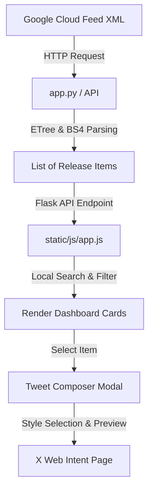

# BigQuery Release Notes Explorer

A modern, high-performance web application built with **Python Flask** on the backend and **vanilla HTML5, CSS3, and JavaScript** on the frontend. It fetches, parses, indexes, and displays release updates from the official Google Cloud BigQuery RSS/Atom Feed, enabling developers to search, filter, and share updates on X/Twitter.

- **GitHub Repository**: [github.com/deshpandehn/antigravity-event-talks-app](https://github.com/deshpandehn/antigravity-event-talks-app)
- **Local Application Link**: [http://127.0.0.1:5000](http://127.0.0.1:5000)

---

## ⚡ Main Features

- **Real-time Feed Syncing**: Fetches updates directly from the official Google Cloud feeds.
- **Smart Parsing**: Automatically parses Atom XML and breaks down individual update entries by their change type (`Feature`, `Change`, `Deprecation`, `Announcement`).
- **Interactive Search & Filter**: Search text dynamically across dates, update types, and descriptions, or filter by category instantly.
- **X/Twitter Composer Modal**:
  - Choose between multiple customized post styles (`⚡ Dev Hype`, `💼 Professional`, `📝 Concise`).
  - Active character counting (280-character limit) with visual circular indicator.
  - Live X-styled post preview before sharing.
  - One-click redirection to Twitter's web intent composer.
- **Smart Caching**: Implements a 1-hour in-memory cache to prevent hitting Google APIs on every page load, with a manual force-refresh toggle.
- **Sleek Glassmorphic Dark UI**: Modern dark theme with custom icons, animations, responsive grid/flexbox layouts, and load skeletons.

---

## 🏗️ Architecture



### Server-Side (Flask)
- Coordinates feed fetching with a 15-second timeout and handles XML to HTML block parsing using `xml.etree.ElementTree`.
- Separates multi-part updates within a single release entry by detecting `<h3>` HTML headers via `BeautifulSoup`.
- Provides a clean `/api/release-notes` REST API that serves in-memory cached results (1-hour TTL) or forces fresh fetches.

### Client-Side (Vanilla JS/CSS)
- Implements a responsive, glassmorphic layout using CSS variables, flexboxes, grid elements, and staggered entrance animations.
- Manages state, handles real-time search indexing, and formats relative timestamps.
- Features a custom Tweet Composer modal with templates and dynamic SVG circular progress metrics for character limits.

---

## 📂 Project Structure

```text
bq-release-notes/
├── app.py                     # Flask server with feed parsing and API endpoints
├── requirements.txt           # Python package dependencies
├── README.md                  # Project documentation
├── .gitignore                 # Excluded directories (venv, cache, IDE files)
├── templates/
│   └── index.html             # Main dashboard UI
└── static/
    ├── css/
    │   └── style.css          # Premium glassmorphic styles
    └── js/
        └── app.js             # UI state, local search/filter, X composer logic
```

---

## 🚀 Setup & Running the Application

### 1. Install Dependencies
Make sure you have Python 3.8+ installed. Install the required libraries:

```bash
pip install -r requirements.txt
```

### 2. Start the Server
Run the Flask server:

```bash
python app.py
```

The application will start running at **`http://127.0.0.1:5000`**. Open this URL in your browser to explore the dashboard.

### 3. Usage
- Click **Refresh Feed** to fetch the latest release notes from Google Cloud.
- Type in the search box to filter updates by keywords.
- Click any tag in the sidebar or filter tabs to filter by update type.
- Click **Copy Link** to copy the official Google Cloud source link.
- Click **Tweet Note** to select an update, open the composer modal, choose a post style, customize it, and share it on X/Twitter.
